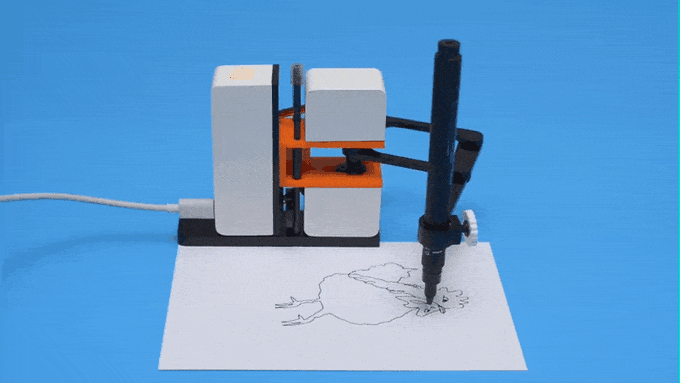

# Drawing Robot

  

 

# 
 dRobTek Group 8 - Semester project 1 

 

## 
Introduction

As a part the robotics technology engineering bachelor education, the first semestes' project is about creating a Drawing Robot. The general idea is to upload an image to a Java program, that then processes and sends commands to a PLC, through a communication socket - Allowing a PLC based drawing robot to draw any given picture, on paper with a pencil. 

 
 

## 
Resources

The resources available from the beginning is a pre-built 3-axis CNC style robot, equipped with 3 NEMA step-motors, as well as a soft-leaded pencil and an electronic pencil sharpener, all controlled using a X20CP1382 Programmable Logic Controller, connected to three ST330-V3 driver boards to establish a connection between the PLC and the step-motors. 
Other than that, four pre-programmed Java classes are made available to every group, three of which are used for image- and pixel manipulation, and the last is used for communicating through a socket connection.

